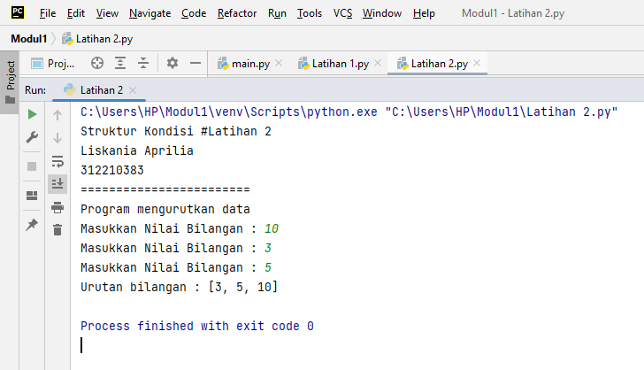
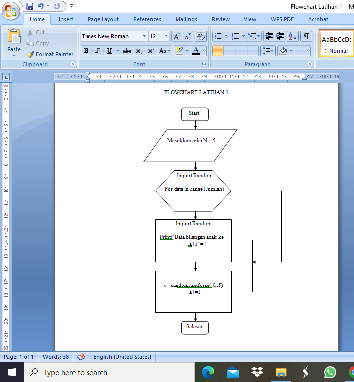
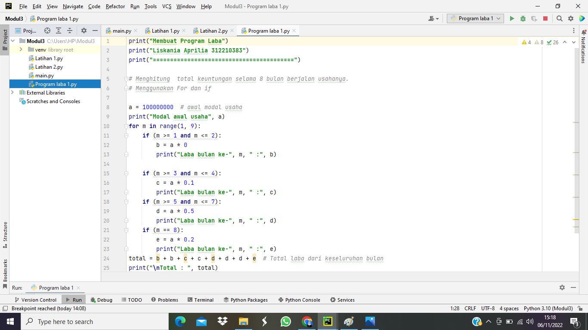

# Praktikum 4

# Modul Praktikum 1 

# Latihan 1 - Struktur Kondisi

1. Input bilangan pada variabel a

2. Input bilangan pada variabel b

3. Gunakan statment if untuk mencari nilai terbesarnya caranya:
- jika bilangan pada variabel a lebih besar dari bilangan pada variabel b maka output nilai terbesar adalah variabel a
- tetapi jika bilangan pada variabel b lebih besar dari bilangan pada bariabel a maka output nilai terbesar adalah variabel b

- Program nya adalah sebagai berikut :

- Hasil dari program yang sudah dijalankan :

# Latihan 2 - Struktur Kondisi

1. Program mengurutkan data dari yang terkecil

2. Inisialisasi variabel dengan nilai berformat, int(input('Masukkan Nilai Bilangan : '))

3. Mengurutkan data bilangan dari yang terkecil, list.sort(data)

4. Tampilkan nilai dari variabel luas setelah pengurutan, print('Urutan bilangan :',data)

- Program nya adalah sebagai berikut :

- Hasil dari program yang sudah dijalankan :

# Latihan 1 - Perulangan (Nested)

1. Membuat perulangan nested yakni perulangan dalam perulangan, menggunakan perulangan for

2. Buat perulangan for pertama dan kedua dengan range(10)
didalam perulangan tersebut terdapat variabel di sini saya menggunakan variabel i dan b,

3. Gunakan statment if untuk mengatur jarak spasi antar perulangannya supaya terlihat rapi dan membentuk pola persegi, dengan cara :

- Jika i + b lebih kecil dari 10 maka jarak hanya dua spasi, tetapi = Jika i + b lebih kecil dari 20 maka jarak hanya satu spasi.

- Lalu print menggunakan end=jarak itu adalah perintah print yang berfungsi membuat perulangan ke samping dan di ikuti juga selanjutnya dengan perintah print(). 

- Program nya adalah sebagai berikut :

- Hasil dari program yang sudah dijalankan :

# Modul Praktikum 2 - Struktur Kondisi

1. Buatlah program untuk menginputkan 3 buah bilangan bertipe data integer atau bilangan bulat: bilangan 1, bilangan 2, dan bilangan 3 dengan menggunakan variabel a,b dan c. variabel a bertipe integer (input("Masukkan nilai a: ")) variabel b bertipe integer (input("Masukkan nilai b: ")) variabel c bertipe int (input("Masukkan nilai c: "))

2. lalu buat statment if untuk mencari bilangan terbesar dari 3 bilangan yang di inputkan tersebut dengan cara:

- jika bilangan a lebih besar dari bilangan b dan c , maka variabel d (variabel untuk menyimpan bilangan terbesar) adalah variabel a, tetapi

- jika bilangan a lebih kecil dari bilangan b dan c , maka varibel d adalah variabel b, tetapi

- jika bilangan c lebih besar dari bilangan b maka varibel d = variabel c
menampilkan bilangan terbesarnya dengan cara memanggil variabel d : jadi bilangan terbesar nya adalah variabel d

- Program nya adalah sebagai berikut :

- Hasil dari program yang sudah dijalankan :

- Flowchart dari program tersebut adalah :

# Modul Praktikum 3 - Perulangan

# 1. Penjelasan Latihan 1

- Mula-mula input nilai N bernilai 5, dengan pernyataan print("Masukkan nilai N : 5"). 

- Kemudian import random, import random ini untuk menghasilkan variabel acak berisi string atau data yang akan di acak.

- Masukkan jumlah = 5 dan a=0 nantinya ini untuk memberi data secara acak yang berjumlah 5 , dan a ini untuk memberi keterangan nomer pada bilangan float(Pecahan)

- Ketik perintah for data in range(jumlah) ini untuk menampilkan list nilai data dengan jarak nilai urut, maksudnya nanti di bilangan float antara nomer 1 sampai 5 itu berbeda.

- Masukkan i = random.uniform (.0,.5)igunakan untuk menampilkan bilangan float random dengan batas awal bilangan x, dan batas akhir bilangan y. lalu masukkan a+ = 1 untuk memberi nomer pada bilangan float.

- Ketik perintah ("Data bilangan acak ke",a,"==>, i), nanti akan muncul hasil nya

- Program nya adalah sebagai berikut :

- Hasil dari program yang sudah dijalankan :

- Flowchart dari program tersebut adalah :

# 2. Penjelasan Latihan 2

- Mula mula input max = 0 . fungsi dari max untuk mencari nilai tertinggi. Fungsi ini dapat diberikan sebuah parameter berupa angka.

- Ketik perintah while True. While disebut uncounted loop (perulangan yang tak terhitung), untuk perulangan yang memiliki syarat dan tidak tentu berapa banyak perulangannya.

- Pernyataan a = int(input("Masukkan bilangan = ")). fungsi dari int berfungsi untuk mengkonversi bilangan maupun string angka menjadi bilangan bulat (integer). input itu utuk masukan yang kita berikan ke program.

- Pernyataan if max < a: max = a if a== 0: break if itu bila suatu kondisi tertentu tercapai maka apa yang harus dilakukan. Dengan fungsi ini kita bisa menjalankan suatu perintah dalam kondisi tertentu. Kenapa max = 0 nantinya 0 itu persamaan dari bilangan terbesar, nah if a== 0 itu harus diakhiri dengan perintah break, break ini untuk memberhentikan perulangan

- Pernyataan print ("Bilangan Terbesar adalah",max). Nantinya ini akan menampilkan bilangan terbesar, dari nilai data yang anda masukkan.

- Program nya adalah sebagai berikut :

- Hasil dari program yang sudah dijalankan :

- Flowchart dari program tersebut adalah :

# 3. Program Laba 1

Soal : 

Seorang pengusaha menginvestasikan uangnya untuk memulai usahanya dengan modal awal 100 juta, pada bulan pertama dan kedua belum mendapatkan laba. pada bulan ketiga baru mulai mendapatkan laba sebesar 1% dan pada bulan ke 5, pendapatan meningkat 5%, selanjutnya pada bulan ke 8 mengalami penurunan keuntungan sebesar 2%, sehingga laba menjadi 3%. Hitung total keuntungan selama 8 bulan berjalan usahanya.

# Penyelesaian menggunakan For, if

- Mula -mula masukkan modal usahanya yaitu a = 100000000

- Gunakan perintah for m in range (1,9):, for ini untuk perulangan dari 1 sampai 8, kenapa menggunakan for,karena for ini perulangan yang terhitung. Pada skirp in range(1, 9) akan mebentuk list perulangan yang berisi [1,2,3,4,5,6,7,8] nah dan bahwa iterasi 9 itu tidak termasuk, untuk membuktikan bawa perulangan ini hanya sampai 8 saja.

- Lalu gunakan perintah _if(m>=1 and m<=2): b=a*0. if pertama ini untuk menentukan laba bulan ke 1 dan ke 2.masukan variable kalikan nilai (a) dengan data bulan 1 dan 2. lalu print("Laba bulan ke-",m," :",b) untuk menampilkan hasil laba. pada bulan pertama dan kedua belum mendapatkan laba jadinya 0.

- if(m>=3 and m<=4): c=a*0.1. if yang kedua ini untuk menentukkan laba bulan ke 3 dan ke 4.masukan variable kalikan nilai (a) dengan data bulan 3 dan 4. pada bulan ke 3 itu baru mendapatkan laba sebesar 1% berarti bulan ke 4 juga sama. lalu cetak (m) dan (c), dengan perintah print("Laba bulan ke-",m," :",c).

- Kemudian if(m>5 and m<=7): d=a*0.5.if ketiga untuk menentukan laba bulan ke 5 sampai ke 7.masukan variable lalu kalikan nilai (a) dengan data bulan 5 sampai 7, pada bulan ke 5 laba naik sebesar 5% berarti pada bulan ke 6 dan 7 kenaikan labanya sama, lalu cetak (m) dan (d), dengan perintah print ("Laba bulan ke-",m," :",d)..

- if(m==8): e=a*0.2 if keempat atau yang terakhir ini untuk menentukan laba bulan ke 8. lalu masukan variabel kalikan nilai (a) dengan data bulan 8. Pada laba bulan ke 8 ini menurun sebanyak 2%, lalu cetak (m) dan (e) dengan perintah_ print ("Laba bulan ke-",m," :",e).

- Kemudian yang terakhir totalkan keseluruhan laba yaitu total = b+b+c+c+d+d+d+e

- lalu print("\nTotal : ", total), untuk menampilkan hasil keseluruhan laba dari bulan pertama sampai bulan kedelapan.

- Program nya adalah sebagai berikut :

- Hasil dari program yang sudah dijalankan :

